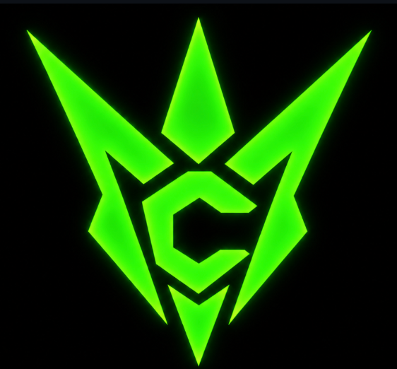

### Copper Linux

  

Copper is a daily-driving Linux distro built from source — not a rebrand of
Debian or Arch. We build the kernel, the libc (musl), and the userland
ourselves, and write the parts that make it *Copper* ourselves too: the shell
(`copper-sh`), the init system (`copper-init`), and the first-boot setup
wizard. Arch and Debian are good, but we wanted to do it *our* way — their
source was used for reference, nothing more.

The build pipeline produces a bootable ISO (~600 MB) that boots in a VM, with
XFCE as the desktop target. Wired networking, a hotfix system
(`copper charge` / `copper rollback`), and a real rollback path are in place
— WiFi and the full desktop stack are still being worked out.

→ [copper-linux.github.io/Copper-linux-website](https://copper-linux.github.io/Copper-linux-website/) ·
[Copper-linux/copper](https://github.com/Copper-linux/copper)

### Deadlight Linux

Deadlight is the security-focused twin of Copper — same base, different
purpose. Where Copper is for daily use, Deadlight is aimed at cybersecurity
work: penetration testing and security research, with the tooling preinstalled
so it works out of the box instead of needing a setup pass afterwards.

**Copper Linux and Deadlight Linux are made by @12hrformat @farcrowx and @Firstspot7
